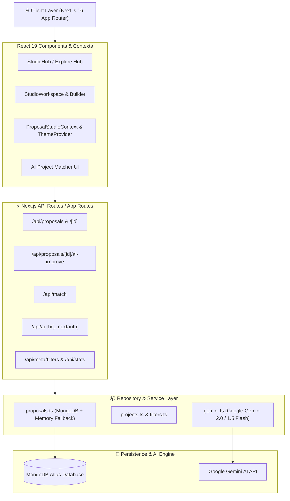

# 🏗️ Contribo Platform - Architecture & Structure Documentation

Contribo is an intelligent open-source contribution and proposal platform built for developer applicants targeting programs like **Google Summer of Code (GSoC)**, **LFX Mentorship**, **Outreachy**, and global open-source initiatives.

---

## 🏛️ System Architecture



---

## 🎯 Technology Stack

| Layer | Technologies & Tools |
| :--- | :--- |
| **Framework** | **Next.js 16.2** (App Router, Turbopack, Server Actions & API Routes) |
| **UI & Styling** | **React 19**, **Tailwind CSS v4**, Custom HSL Color System (`#2B1B15` / `#FBF9F6`), **Framer Motion**, **Lucide Icons** |
| **State Management** | **React Context API** (`ProposalStudioContext`), **Custom Hooks** (`useProposalStudio`, `useDebounce`) |
| **Database & Cache** | **MongoDB 6.x** (MongoDB Atlas) with **in-memory resilient fallback system** |
| **Authentication** | **NextAuth.js v5** (GitHub & Google OAuth Providers + MongoAdapter) |
| **AI Processing** | **Google Gemini AI** (`gemini-2.0-flash`, `gemini-1.5-flash`), **OpenAI API** fallback |
| **Deployment / Build** | **Vercel / Node.js**, TypeScript static type checking, automated SSR/SSG route generation |

---

## 📁 Complete Directory & File Structure

```
Contribo/
├── src/
│   ├── app/                               # Next.js App Router Routes & Pages
│   │   ├── layout.tsx                     # Global Root Layout (Fonts, Metadata, Providers)
│   │   ├── page.tsx                       # Homepage (Hero, Stats, Trending Projects)
│   │   ├── proposal-studio/               # Main Proposal Studio App Entry (/proposal-studio)
│   │   │   └── page.tsx
│   │   ├── matcher/                       # AI Project Skill Matcher Page
│   │   ├── projects/                      # Open Source Projects Catalog (/projects)
│   │   ├── programs/                      # GSoC / LFX / Outreachy Programs Explorer
│   │   ├── organizations/                 # Participating Orgs Directory
│   │   ├── dashboard/                     # User Application Tracking Dashboard
│   │   └── api/                           # Backend REST & AI Endpoints
│   │       ├── proposals/                 # GET, POST /api/proposals
│   │       │   ├── [id]/                  # GET, PATCH, DELETE /api/proposals/[id]
│   │       │   │   └── ai-improve/        # POST /api/proposals/[id]/ai-improve (Gemini AI)
│   │       │   ├── examples/              # GET /api/proposals/examples
│   │       │   └── guide/                 # GET /api/proposals/guide
│   │       ├── match/                     # POST /api/match (AI Skill Matching)
│   │       └── auth/[...nextauth]/        # NextAuth.js OAuth Handler
│   │
│   ├── components/                        # UI Components & Feature Modules
│   │   ├── proposal-studio/               # Modular Proposal Studio Workspaces
│   │   │   ├── StudioHub.tsx              # Modern Borderless Hero, Draft List & Process
│   │   │   ├── StudioWorkspace.tsx        # Full-Page Workspace Shell & Mode Navigation
│   │   │   ├── context/                   # ProposalStudioContext.tsx
│   │   │   ├── hooks/                     # useProposalStudio.ts (State & Autosave Engine)
│   │   │   ├── panels/                    # Overview, Builder, Library, Guide, Review, Export
│   │   │   └── ui/                        # Modals (ProposalVersionModal), Badges, Meters
│   │   ├── home/                          # Hero, Features, Trending Projects, Stats Bar
│   │   ├── ui/                            # ProjectCard, Navbar, Footer, Filters, Modals
│   │
│   ├── lib/                               # Data Access, AI Logic & Utilities
│   │   ├── ai/                            # gemini.ts (Google Gemini 2.0/1.5 Flash Client)
│   │   ├── db.ts                          # Resilient MongoDB Client & Connection Pool
│   │   ├── client/                        # api.ts (Frontend API Helper Functions)
│   │   ├── proposal-studio/               # Data types, benchmark examples & guidelines
│   │   └── repositories/                  # Data Repository Abstraction Layer
│   │       ├── proposals.ts               # Complete Proposal CRUD + Gemini AI Integrations
│   │       ├── projects.ts                # Project filtering & search queries
│   │       ├── programs.ts                # Program & Organization queries
│   │       └── filters.ts                 # Filter metadata aggregation
│   │
│   └── types/                             # TypeScript Interface Declarations
├── public/                                # Static Assets (Logos, Hero Illustrations)
├── scripts/                               # Database Seeding & Ingestion Utilities
└── .env                                   # Environment Secrets (MongoDB URI, Gemini Key, OAuth)
```

---

## ⚡ Core Feature Modules & Implementation Details

### 1. Proposal Studio Workspace (`/proposal-studio`)
- **Hub View (`StudioHub.tsx`)**:
  - Borderless modern layout featuring an interactive product mockup graphic with **Inverted Theme Contrast** (Dark IDE styling in Light mode, Light editor styling in Dark mode).
  - Real-time **4-step interactive proposal flowchart** (`01. Select Org` ➔ `02. Fill 8 Sections` ➔ `03. AI Review` ➔ `04. Export`).
  - Active draft listing with one-click workspace opening, progress meters, and draft deletion.
- **Workspace View (`StudioWorkspace.tsx`)**:
  - Full-page natural scrolling canvas (`max-w-[1440px]`).
  - 8 Maintainer-aligned section writing panels (`BuilderPanel.tsx`).
  - **Auto-Save Engine**: 450ms debounced auto-save handler pushing edits to MongoDB/memory.
  - **Version History & Snapshot Restoration (`ProposalVersionModal.tsx`)**: Inspect auto-saved checkpoints and restore past section snapshots with 1 click.

---

### 2. Google Gemini AI Engine (`src/lib/ai/gemini.ts`)
- **Live AI Section Improvement**: Connected via `POST /api/proposals/[id]/ai-improve`.
- **Model Fallback Pipeline**: Uses Google `gemini-2.0-flash` with automatic failover to `gemini-1.5-flash`.
- **Maintainer Benchmarking**: Analyzes proposal drafts against maintainer expectations, augmenting technical specificity, test coverage goals (e.g. PyTest/Jest 90%+), and risk buffers.

---

### 3. Data Persistence & Resilient Fallback System (`src/lib/db.ts` & `src/lib/repositories/proposals.ts`)
- **Dual-Layer Data Architecture**: Direct connection to **MongoDB Atlas** (`proposals` collection).
- **In-Memory Graceful Fallback**: If offline or during static compilation, the repository gracefully falls back to an in-memory cache, ensuring 100% uptime and preventing build breaks.

---

## 🚀 Build & Production Verification
- **Compilation**: Clean Next.js production build (`npm run build`).
- **Type Safety**: Passed TypeScript static type-checking with **0 errors** across all 33 static and dynamic routes.
