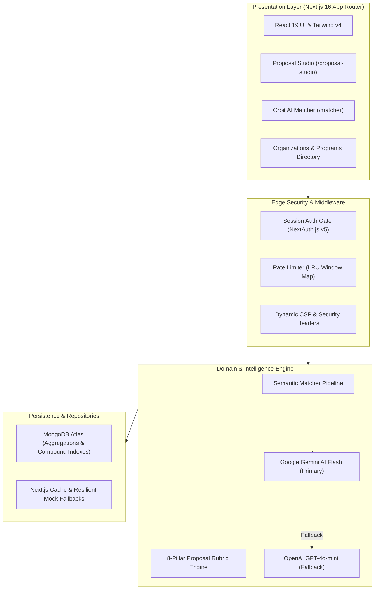

<p align="center">
  
</p>

<h1 align="center">Contribo</h1>

<p align="center">
  <strong>The Universal Open Source Mentorship & Programs Hub</strong><br>
  Discover 12,000+ projects, explore 600+ organizations, match your skills with Orbit AI, and craft winning proposals.
</p>

<p align="center">
  <a href="https://contribo-one.vercel.app"></a>
  <a href="https://github.com/subhranshudash13-dotcom/Contribo/blob/main/LICENSE"></a>
  <a href="https://github.com/subhranshudash13-dotcom/Contribo/pulls"></a>
  <a href="https://github.com/subhranshudash13-dotcom/Contribo/issues"></a>
</p>

<p align="center">
  
  
  
  
  
  
  
</p>

---

## 🌟 Vision & Mission

**Contribo** is built on a simple belief: *open-source contribution should be accessible, transparent, and structured for everyone.* 

Navigating dozens of mentorship programs across isolated websites, buried issue trackers, and complex stipend tables creates friction. Contribo unifies everything under an intuitive, high-performance command center — empowering students, developers, and maintainers worldwide to connect, collaborate, and build impactful software together.

---

## 🚀 Supported Open Source Programs

Contribo aggregates, categorizes, and standardizes opportunities across all major global initiatives:

| Program | Organizing Body | Focus Area | Standard Stipend |
| :--- | :--- | :--- | :--- |
| **Google Summer of Code (GSoC)** | Google Open Source | Broad OSS Software Engineering | $1,500 – $6,600 USD (PPP) |
| **LFX Mentorship** | Linux Foundation | Cloud Native, Kernel, Systems | $3,000 – $6,600 USD |
| **European Summer of Code (ESoC)** | Free & Open Source EU | European Digital Sovereignty | €3,000 – €6,000 EUR |
| **Outreachy** | Software Freedom Conservancy | Diversity & Underrepresented Tech | $7,000 USD + $500 Travel |
| **Summer of Bitcoin (SOB)** | Bitcoin Open Source Community | Cryptography, Layer-2, Rust | Stipend in BTC / USD |
| **MLH Fellowship** | Major League Hacking | Real-world Production Engineering | Educational Stipend |
| **Hacktoberfest** | DigitalOcean & Partners | First-time & Community Contributions | Badges & Tree Planting |
| **GirlScript Summer of Code (GSSoC)** | GirlScript Foundation | Beginner-friendly Mentorship | Swag, Certificates & Perks |
| **Nexus Spring of Code (NSoC)** | Nexus Foundation | Emerging Tech & Tooling | Performance Stipends |

---

## ✨ Core Pillars

### 1. 🔍 Universal Directory & Granular Search
- **12,000+ Projects & 600+ Organizations:** Unified dataset with historical acceptance rates and tech stacks.
- **Command Palette (`Cmd/Ctrl + K`):** Lightning-fast keyboard navigation across projects, guides, and actions.
- **Multi-Facet Filtering:** Filter by difficulty (Beginner, Intermediate, Advanced), domain, and active program year.

### 2. 🤖 Orbit AI Semantic Matcher
- **Intelligent Profile Matching:** Powered by **Google Gemini AI** and semantic token expansion.
- **Personalized Recommendations:** Evaluates your technical skills, experience level, and weekly availability to recommend the best matching organizations with custom rationale.

### 3. 📝 Proposal Studio
- **Guided Proposal Editor:** Draft mentorship proposals with real-time word/character count and milestone breakdown.
- **Maintainer Rubric Engine:** Evaluates draft quality across 8 criteria (architecture, timeline realism, risk mitigation, test coverage).
- **Export Ready:** Generate publication-ready proposal files formatted for GSoC/LFX submission.

### 4. 📊 Personal Command Center & Deadlines
- **Application Tracking:** Track application stages (Drafting, Submitted, Accepted, Milestone Review).
- **Countdown Timelines:** Visual calendar of upcoming application windows and proposal deadlines.

---

## 🏛️ System Architecture



---

## ⚡ Quickstart & Local Development

### Prerequisites
- **Node.js:** `v20.x` or later
- **npm:** `v10.x` or later
- **MongoDB:** Local instance or free [MongoDB Atlas Cluster](https://www.mongodb.com/atlas)

### 1. Clone Repository
```bash
git clone https://github.com/subhranshudash13-dotcom/Contribo.git
cd Contribo
```

### 2. Install Dependencies
```bash
npm install
```

### 3. Setup Environment Variables
Copy the example environment template:
```bash
cp .env.example .env
```
Open `.env` and fill in your values:
```ini
# Database
MONGODB_URI=mongodb+srv://<username>:<password>@<cluster>.mongodb.net/contribo
MONGODB_DB=contribo

# Authentication
AUTH_SECRET=your_auth_secret_minimum_16_characters
AUTH_URL=http://localhost:3000

# OAuth Providers (Optional for local testing)
AUTH_GITHUB_ID=your_github_oauth_client_id
AUTH_GITHUB_SECRET=your_github_oauth_client_secret

# AI Matcher (Google Gemini recommended)
GEMINI_API_KEY=your_gemini_api_key_here
AI_PROVIDER=gemini
```
> **Security Note:** Never commit `.env` or real API keys to version control. All secrets are strictly ignored by `.gitignore`.

### 4. Seed Database (Optional)
Seed default open-source programs and sample projects:
```bash
npm run db:setup
```

### 5. Run Development Server
```bash
npm run dev
```
Open [http://localhost:3000](http://localhost:3000) in your browser.

---

## 🧪 Testing & Validation

```bash
# Run ESLint validation
npm run lint

# Run TypeScript type safety check
npx tsc --noEmit

# Run unit test suite
npm test

# Build production bundle
npm run build
```

---

## 🤝 Contributing to Contribo

We welcome contributions of **all kinds** from developers around the globe — whether you're fixing bugs, adding new mentorship programs, enhancing UI/UX, optimizing algorithms, or sharing feature ideas!

### How to Get Started:
1. 🔎 **Find an Issue:** Browse open issues tagged with [`good first issue`](https://github.com/subhranshudash13-dotcom/Contribo/issues?q=is%3Aissue+is%3Aopen+label%3A%22good+first+issue%22) or [`help wanted`](https://github.com/subhranshudash13-dotcom/Contribo/issues?q=is%3Aissue+is%3Aopen+label%3A%22help+wanted%22).
2. 💬 **Discuss / Claim:** Comment on the issue you'd like to work on so we can assign it to you.
3. 🍴 **Fork & Branch:** Create a feature branch (`git checkout -b feat/your-feature-name`).
4. 🛠️ **Implement & Test:** Write clean code, adhere to TypeScript standards, and run `npm test`.
5. 🚀 **Submit PR:** Open a Pull Request referencing the issue (e.g., `Closes #12`). Our **CodeRabbit AI** and GitHub Actions CI will automatically review and validate your code!

### 💡 Have an Idea or Feature Request?
We'd love to hear it! Open a [New Feature Proposal](https://github.com/subhranshudash13-dotcom/Contribo/issues/new) or start a discussion in our community.

---

## 🛡️ Security & Responsible Disclosure

Security is a top priority for Contribo:
- Passwords are encrypted using constant-time `scrypt` hashing.
- API inputs are sanitized with sliding-window rate limiting.
- Strict Content Security Policies (CSP) and security headers are enforced across all routes.

If you discover a security vulnerability, please report it privately to the maintainers rather than opening a public issue.

---

## 📄 License

Contribo is open-source software licensed under the [MIT License](LICENSE).

---

<p align="center">
  Built with ❤️ for the global open-source contributor community.<br>
  <strong>Star ⭐ this repository if you find Contribo helpful!</strong>
</p>
